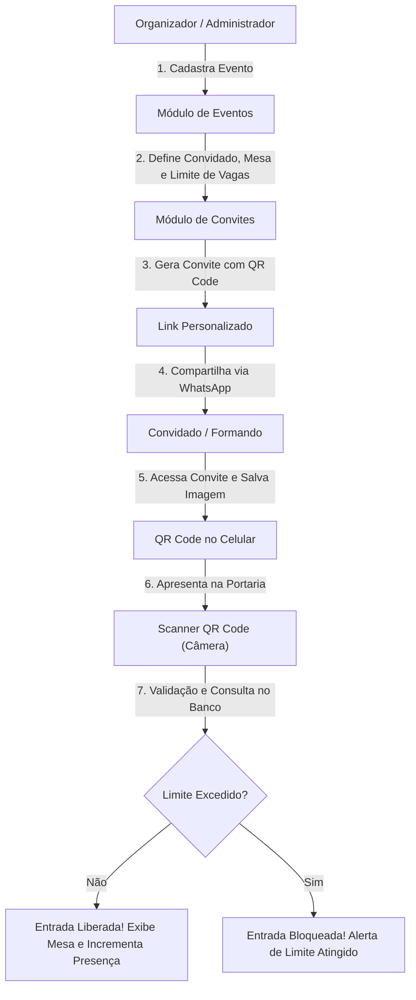

# Documentação do Sistema - Centenário Eventos / Validador com Scanner QR Code

---

## 1. Visão Geral do Sistema

O **Sistema de Gestão de Eventos com Scanner QR Code** é uma plataforma web integrada concebida para modernizar, automatizar e proteger todo o ciclo de vida da recepção de eventos sociais e corporativos. 

A plataforma conecta organizadores, anfitriões/formandos e convidados em uma experiência fluida: desde o cadastro do evento, passando pela emissão de convites digitais personalizados com envio direto via WhatsApp, até o credenciamento e validação de acessos na portaria em tempo real via câmera (smartphone, tablet ou computador).

---

## 2. Onde o Sistema vai Atuar (Mercado e Nichos)

O sistema foi desenhado para atuar no mercado de eventos presenciais e híbridos, especificamente em:

1. **Formaturas e Colações de Grau:**
   - Cada formando possui sua cota de convidados e mesa definida.
   - O controle de acompanhantes por formando é rigorosamente fiscalizado na entrada.
2. **Casamentos e Bodas:**
   - Gestão de confirmação de presença (RSVP), direcionamento de mesas para famílias e credenciamento ágil.
3. **Casas de Festas, Buffets e Salões de Recepção:**
   - Profissionalização do atendimento na recepção, evitando superlotação e garantindo a capacidade contratada.
4. **Eventos Corporativos, Congressos e Palestras:**
   - Controle de acesso de credenciados, palestrantes e participantes sem necessidade de equipamentos caros de catraca.
5. **Festas de Aniversário e Debutantes (15 Anos):**
   - Eliminação de penetras e controle simplificado da lista de amigos e familiares.

---

## 3. Problemas que o Sistema Resolve

| Problema Tradicional | Solução do Sistema |
|---|---|
| **Fraudes e Invasões de Convidados ("Penetras")** | Cada convite gera um **QR Code único**, atrelado ao nome, telefone e mesa do convidado. Uma vez escaneado e atingida a cota, novos acessos com o mesmo código são bloqueados. |
| **Filas e Lentidão na Portaria** | Fim das pranchetas e listas de papel em ordem alfabética. A validação do QR Code é instantânea pela câmera do celular/tablet da recepção. |
| **Custo e Desperdício de Convites Físicos** | Solução **100% digital e sustentável (*Paperless*)**. Os convites são compartilhados em segundos via WhatsApp, sem custo de impressão gráfica. |
| **Falta de Controle de Acompanhantes** | O sistema gerencia a contagem de entradas: se um convidado tem direito a 3 pessoas, o sistema permite exatamente 3 leituras válidas para aquele código. |
| **Dificuldade na Alocação de Mesas** | No momento da leitura na portaria, a tela do recepcionista exibe imediatamente o número da mesa atribuída ao convidado, facilitando a recepção. |
| **Logística de Envio Complexa** | Disparo pré-formatado via **API do WhatsApp Web**, permitindo que o anfitrião envie o link individual com apenas um clique. |

---

## 4. Jornada do Usuário e Fluxo Operacional

---

## 5. Módulos e Funcionalidades

### 5.1. Módulo Institucional / Landing Page (`index.html`)
* **Apresentação da Marca:** Destaque dos diferenciais competitivos e serviços da empresa.
* **Carrossel Interativo:** Galeria de imagens dos eventos realizados.
* **Acesso Rápido:** Direcionamento direto para cadastro de novos organizadores ou login no sistema.

### 5.2. Módulo de Autenticação e Segurança (`Sistema/Login/` e `Sistema/Cadastro/`)
* **Acesso Administrativo:** Login seguro por CPF e senha com opção de visualização de caracteres.
* **Cadastro de Organizadores:** Formulário com validação de formato e dígitos verificadores de CPF.
* **Recuperação de Senha:** Interface para redefinição de credenciais de acesso.

### 5.3. Painel Administrativo Central (`Sistema/menuAdmin/`)
* **Hub Operacional:** Interface em cards que centraliza o acesso às três principais operações do evento:
  1. *Scanner de Portaria*;
  2. *Cadastro de Eventos*;
  3. *Emissão de Convites*.

### 5.4. Gestão de Eventos (`Sistema/Evento/`)
* **Cadastro Detalhado:** Nome do evento, local, data, horário, organizador, código de vestimenta (*dress code*) e prazo de confirmação.
* **Regras de Validação Inteligente:**
  * Bloqueio estrito de datas retroativas (anteriores ao dia atual).
  * Alerta de confirmação caso o evento seja cadastrado para data inferior a 14 dias (prazo crítico de organização).

### 5.5. Emissão e Distribuição de Convites (`Sistema/Convite/`)
* **Vínculo Dinâmico:** Seleção do evento previamente cadastrado com autopreenchimento das informações de data, hora e local.
* **Parâmetros por Convidado:**
  * Nome do formando ou convidado principal (com normalização de acentuação para busca sem erros).
  * Telefone para contato.
  * Número da mesa reservada.
  * Quantidade máxima de acompanhantes permitidos.
* **Disparo via WhatsApp:** Geração do link oficial (`VisualizarConvite.html`) com mensagem personalizada para envio direto pelo mensageiro.

### 5.6. Cartão Digital do Convidado (`Sistema/Convite/VisualizarConvite.html`)
* **Design Responsivo e Elegante:** Cartão visual com todos os detalhes do evento e da mesa.
* **QR Code Dinâmico:** Gerado via biblioteca de alta fidelidade com os dados estruturados do convite.
* **Download Instantâneo:** Recurso que converte o convite visual em imagem (`convite.png`) com alta resolução, permitindo que o convidado guarde na galeria do celular mesmo sem sinal de internet no local do evento.

### 5.7. Estação de Credenciamento / Scanner (`Sistema/Scanner/`)
* **Recepção Automatizada:** Uso da câmera do dispositivo em tempo real sem necessidade de leitores ópticos dedicados ou periféricos caros.
* **Controle de Presença e Cotas:**
  * Decodificação imediata do QR Code lido.
  * Busca e conferência na base de dados em nuvem.
  * Incremento do contador de acessos (`contagem = contagem + 1`).
  * Bloqueio visual imediato se `contagem >= limite`.
* **Identificação de Mesa:** Exibição clara na tela para que os recepcionistas indiquem o local do convidado.

---

## 6. Arquitetura Técnica e Tecnologias

### 6.1. Frontend
* **Linguagens:** HTML5 semântico, CSS3 com variáveis e Flexbox/Grid, JavaScript moderno (ES6+ com ES Modules nativos).
* **Padrão de Projeto:** Separação estrita em camadas (Arquitetura em Camadas / MVC adaptado para cliente):
  * `Modelo/`: Definições das entidades de negócio.
  * `DAO/` (*Data Access Object*): Comunicação direta e isolada com o banco de dados.
  * `Servico/`: Regras de negócio, sanitização de dados e tratamento de exceções.
  * `Controle/`: Interação entre a camada de apresentação (HTML) e as regras de serviço.
  * `Suporte/`: Validadores reutilizáveis (algoritmo oficial de CPF, formatação de telefone, normalização de strings).

### 6.2. Serviços em Nuvem e Bibliotecas
* **Banco de Dados (BaaS):** [Supabase](https://supabase.com/) (PostgreSQL gerenciado com conexão via `@supabase/supabase-js`).
* **Renderização de QR Code:** `qrcodejs` (versão 1.0.0).
* **Leitura de Câmera e Decodificação:** `html5-qrcode`.
* **Exportação para Imagem:** `html2canvas` (versão 1.4.1).

### 6.3. Backend Opcional / Próxima Fase
* Localizado em `Backend/evento/evento/`, contendo o esqueleto em **Java com Spring Boot**, **Maven** e **Docker Compose (PostgreSQL)**, projetado para suportar uma eventual migração para API REST corporativa dedicada.

---

## 7. Modelo de Dados (Tabelas do Banco)

### Tabela `Cliente` (Organizadores do Sistema)
| Campo | Tipo | Descrição |
|---|---|---|
| `cpf` | Text (PK) | CPF do organizador (apenas números) |
| `nome` | Text | Nome do organizador |
| `senha` | Text | Senha de autenticação |

### Tabela `Evento`
| Campo | Tipo | Descrição |
|---|---|---|
| `id` | Serial / UUID (PK) | Identificador único do evento |
| `nome` | Text | Nome ou título do evento |
| `local` | Text | Local e endereço da celebração |
| `data` | Text / Date | Data do evento |
| `hora` | Text / Time | Horário de início |

### Tabela `Convidado`
| Campo | Tipo | Descrição |
|---|---|---|
| `id` | Serial / UUID (PK) | Identificador único do convidado |
| `nome` | Text | Nome completo normalizado do formando/convidado |
| `telefone` | Text | Telefone celular (chave de contato e identificação) |
| `mesa` | Integer | Número da mesa reservada no salão |
| `limite` | Integer | Quantidade total de pessoas autorizadas para aquele convite |
| `contagem` | Integer | Número de vezes que o QR Code já foi validado na portaria |

---

## 8. Benefícios Estratégicos e Retorno de Investimento (ROI)

1. **Agilidade no Acesso:** Redução do tempo médio de entrada de cada convidado de minutos para meros 3 segundos.
2. **Eliminação de Custos de Impressão:** Economia de centenas ou milhares de reais por evento em papéis especiais e impressões gráficas.
3. **Segurança Reforçada:** Certeza de que a lotação contratada e a lista de presentes respeitam o contrato do buffet/espaço.
4. **Imagem de Modernidade:** Transmite aos convidados uma percepção de inovação e requinte tecnológico desde o primeiro contato no WhatsApp.
5. **Independência de Hardware:** Não requer pistolas leitoras a laser ou coletores de dados; qualquer smartphone de recepcionista serve como estação de validação.
